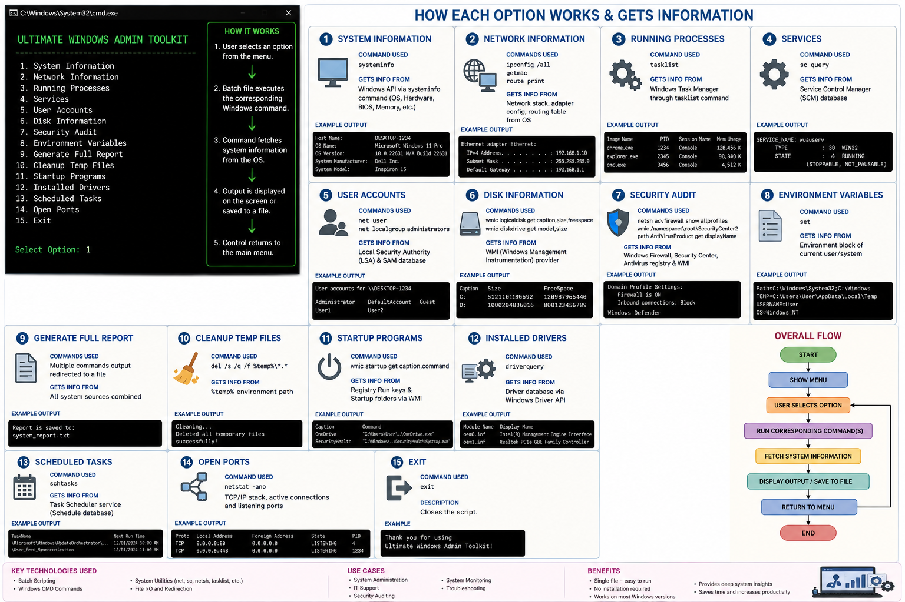

# Ultimate Windows Admin Toolkit

A powerful Windows Batch Script toolkit for system administrators, IT support engineers, students, and power users. This toolkit provides quick access to essential system administration, diagnostics, auditing, and reporting utilities through a simple menu-driven interface.
<p align="center">
    
</p>

## Features

### System Information

* View hostname
* Display complete system configuration
* Hardware and OS details

### Network Information

* IP configuration details
* MAC addresses
* Routing table information

### Process Management

* List all running processes

### Service Monitoring

* View installed and running Windows services

### User Account Management

* List local users
* Display administrator group members

### Disk Information

* View logical disks
* Check free space
* Display physical drive information

### Security Audit

* Firewall status
* Installed antivirus products

### Environment Variables

* Display all system and user environment variables

### Startup Programs

* View applications configured to start automatically

### Driver Information

* List installed drivers

### Scheduled Tasks

* Display all scheduled tasks

### Open Ports

* View active network connections and listening ports

### Temporary File Cleanup

* Remove temporary files from the current user profile

### Full System Report

* Generate a comprehensive report containing:

  * System information
  * Network details
  * User accounts
  * Disk information
  * Running processes
  * Services
  * Open ports

## Requirements

* Windows 10 / 11
* Administrator privileges recommended
* Command Prompt (CMD)

## Usage

1. Download or clone the repository.

```bash
git clone https://github.com/yourusername/ultimate-windows-admin-toolkit.git
```

2. Open Command Prompt as Administrator.

3. Navigate to the project folder.

```cmd
cd ultimate-windows-admin-toolkit
```

4. Run the script.

```cmd
UltimateWindowsAdminToolkit.bat
```

## Generated Report

Selecting "Generate Full Report" creates:

```text
system_report.txt
```

The report contains detailed system diagnostics and audit information useful for troubleshooting and documentation.

## Project Structure

```text
ultimate-windows-admin-toolkit/
│
├── UltimateWindowsAdminToolkit.bat
├── README.md
└── system_report.txt (generated)
```

## Use Cases

* System administration
* IT support troubleshooting
* Security auditing
* Network diagnostics
* Lab and classroom environments
* Learning Windows administration commands

## Disclaimer

This tool is intended for educational, administrative, and troubleshooting purposes. Review generated reports carefully before sharing them, as they may contain system-specific information.

## License

MIT License
